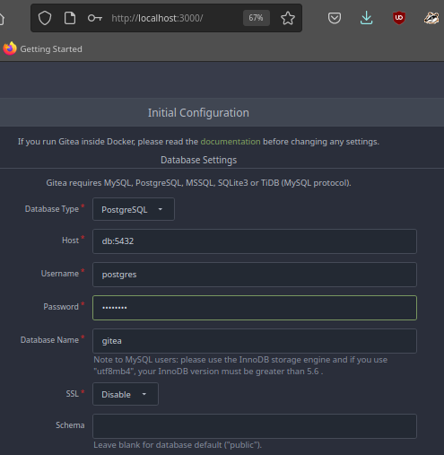
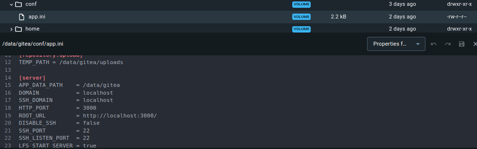

# Gitea setup guide


This setup assumes you're using a native linux install. If you're using Windows you could probably use [WSL2](https://learn.microsoft.com/en-us/windows/wsl/install).

platform: Ubuntu 22.04

requires:
- bash>=5
- python3
- docker version>=23.0.0
- docker-desktop version>=4.18.0

---

## Table of Contents
- [directory structure](#directory-structure)
- [setup with docker](#setup)
- [manual install](#set-up-gitea-service-from-binary)
- [docker command reference](#docker-commands-reference)


---

## Directory structure and important files
- `bin/` - put your gitea binary here
- `custom/` - files for customizing gitea, https://docs.gitea.io/en-us/administration/customizing-gitea/
- [DEPRECATED] `docker/` - bind volumes for docker, https://docs.gitea.io/en-us/installation/install-with-docker/
- `util/` - convenience scripts
- `.git` - files used with git
- `.env` - environmental variables for docker compose
- `start.sh` - script to startup docker compose services

---

## Install

Install flow: `./service.sh` -> `docker build` -> `util/docker-compose.py` -> `docker compose up`

Install files to a directory or use as is
- default installation path :  `$HOME/service/gitea` 

The install copies the current directory to target directory

|method|command|description
|---|---|---|
|bash| `$ ./install.sh [/path/to/install/]`| install to `/path/to/install`|
|python| `$ python install.py [/path/to/install/]`| installs to `/path/to/install/`


## Quick Start with Docker Compose

Create patched docker image:
- `./build-docker.sh`

Verify image was created: `docker images`
```
REPOSITORY                     TAG             IMAGE ID       CREATED          SIZE
pg                             gitea           345346c827b8   26 seconds ago   379MB

```

Change environment variables to desired ports in `.env`

.env defaults
```
gitea_port=7777
gitea_ssh_port=2221
```

Run:
```
$ ./service.sh <up|down>
```
Starts Postgres on `http://localhost:5432`, and Gitea on `http://localhost:7777` by default



Customize Docker-gitea

Check environmental variable gitea uses:

`docker exec container env`

By default:
- `GITEA_CUSTOM` -> `/data/gitea`

gitea reads fromm a `/data/gitea/conf/app.ini` to customize settings

app.ini
```ini
[server]
PROTOCOL  = http
ROOT_URL  = http://localhost:3000
HTTP_PORT = 3000
```

How to Copy your custom configuration to $GITEA_CUSTOM/app.ini
- `docker cp app.ini docker-gitea-1:/data/gitea/conf/app.ini`

Change it with docker desktop



Restart docker container:


---

## Set up gitea service manually

### Download gitea

Do this if you're not using docker.

download: [here](https://docs.gitea.io/en-us/installation/install-from-binary/)

Put the binary for your platform into the `bin` folder, the default `gitea.service` file uses that to run

Go [here](./setup-gitea-service.md)

[original_src](https://docs.gitea.io/en-us/installation/install-from-binary/) for more details


---

## Docker Commands Reference
[see](https://docs.gitea.io/en-us/installation/install-with-docker/)

### Start services with docker compose

if compose file is the default: `docker-compose.yml`:
- `docker compose up`

if custom file name:
- `$ docker compose -f <your-docker-compose.yml> up`

this repo:
- `$ docker compose -f docker-gitea-compose-v3.yml up` 

You can also use the convenience scripts:
- `$ python util/docker-compose.py <up | down>`


---

## Useful commands in docker

- List containers
- `docker ps`

- Run bash inside docker container
- `docker exec --interactive --tty <your-postgres-container> bash`


## Troubleshooting

When running docker compose and 
If you get a error: mount denied, try using docker desktop to add to the folders to shared paths:
see: https://docs.docker.com/desktop/settings/linux/#file-sharing


Logging error
- Use `./docker-build.sh` to build the new image with log directory `pg:gitea`
- Run `python util/docker-compose up -l`

---


## DEPRECATED
### Volume mappings (deprecated), using named volumes now

| host | service | container |
| --- | --- | --- |
|`docker/gitea-data`| gitea | `/data` |
|`docker/gitea-pg-data`| db | `/var/lib/postgres/data/`|