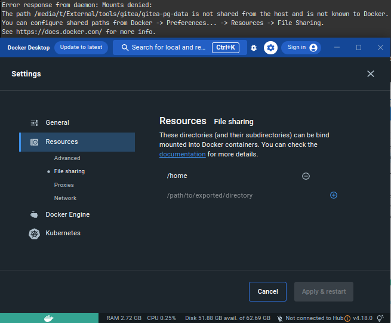

# Gitea setup guide

This setup assumes you're using a native linux install. If you're using Windows you could probably use [WSL2](https://learn.microsoft.com/en-us/windows/wsl/install).

platform: Ubuntu 22.04

requires:
- bash
- python3
- docker version>=23.0.0
- docker-desktop version>=4.18.0

## Quick start

Install files to a directory, default is `$HOME/tools/gitea` 
- `$(project-root) ./install.sh [path/to/install/]` or
- `$(project-root) python install.py [path/to/install/`]

Start docker services
- `$(project-root) python util/docker-compose.py < up | down >`

## Directory structure
- `bin` - put your binaries here
- `custom` - files for customizing gitea, https://docs.gitea.io/en-us/administration/customizing-gitea/
- `docker` - volumes for docker, https://docs.gitea.io/en-us/installation/install-with-docker/
- `util` - convenience scripts
- `.git` - files used with git

## Setup

## Download gitea
download: [here](https://docs.gitea.io/en-us/installation/install-from-binary/)

put the binary into the `bin` folder, the default `gitea.service` file uses that to run

## Set up gitea service from binary

If not using docker, 
look [here](./setup-gitea-service.md)

[original_src](https://docs.gitea.io/en-us/installation/install-from-binary/) for more details

---

## Use with docker compose
[see](https://docs.gitea.io/en-us/installation/install-with-docker/)

### Start services with docker compose

if compose file is the default: `docker-compose.yml`:
- `docker compose up`

if custom file name:
- `$ docker compose -f <your-docker-compose.yml> up`

this repo:
- `$ docker compose -f docker-gitea-compose-v3.yml up` 

You can also use the convenience scripts:
- `$ python util/docker-compose.py <up | down>`

## Useful commands in docker

- List containers
- `docker ps`

- Run bash inside docker container
- `docker exec --interactive --tty <your-postgres-container> bash`

### Volume mappings

| host | service | container |
| --- | --- | --- |
|`docker/gitea-data`| gitea | `/data` |
|`docker/gitea-pg-data`| db | `/var/lib/postgres/data/`|

## Troubleshooting

When running docker compose and 
If you get a error: mount denied, try using docker desktop to add to the folders to shared paths:
see: https://docs.docker.com/desktop/settings/linux/#file-sharing

Logging error
- Use `./docker-build.sh` to build the new image with log directory `pg:gitea`
- Run `python util/docker-compose up -t`

---